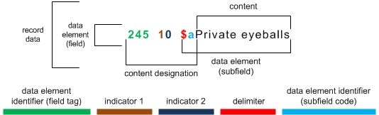
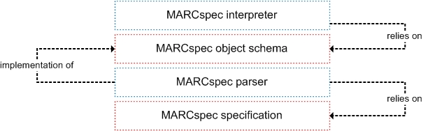

# MARCspec - a common MARC record path language

## Abstract

MARCspec is a specification for referencing data in MARC records. MARCspec expressions are encoded as string and the purpose of the specification is it to unify the way how MARC data gets referenced. Relying on this specification, MARCspec parsers could be build, which serve as a basis and assure a common syntax for filter functionalities across different tools.

## Introduction

People who are familiar with the MARC21 format [^1] and especially with the MARC21 format for bibliographic data [[^2]] know what it means when they read

    245 $a

For those who don't: It is a simple way to express that we talk about the content of the subfield 'a' of the field '245' in a MARC record. You can do this with every combination of field and subfield possible by the MARC specification. In general this is referred to as __MARC field specification__ or shorter a __MARC spec__.

Such field specifications are commonly used for documentation or illustrative issues like mappings (see [[^3]]). But also existing tools like solrmarc [[^4]] or catmandu [[^5]] are using their own flavour of MARC field specifications as a tool specific configuration language. You cannot expect the same MARC field specification is working across different tools.

The purpose of the hereby described specification __MARCspec__ [[^6]] is it to unify the way a MARC field specification is expressed. MARCspec parsers could then be build on top of this specification working as a basis of different tools and assuring a common syntax for MARC field specifications across different tools.

The current version of MARCspec is a preliminary draft for open discussion. Feedback [[^7]] is welcome!

## What is a MARCspec?

To understand what a MARCspec represents one must have a basic knowledge on the MARC principles. For further references I'm giving a brief introduction. Please skip the next paragraph if you are familiar with MARC.

Machine-Readable Cataloguing (MARC) is a document-based key-value exchange format for bibliographic and other library related data. A MARC record consists of three main sections: the leader, the directory, and the variable fields with the data content. There are two kinds of (variable) fields: (variable) control fields and (variable) data fields. The term 'fixed field' stands for fields whose length does not vary, like the leader and some of the control fields. The field content in the the fixed fields can be accessed through its character position or character range. Only data fields are divided into subfields. Subfields can also be contextualized through indicators. There is an indicator 1 and an indicator 2 for all data fields, both are optional. For a deeper explanation of MARC see [[^8]] and [[^9]].

This image illustrates the structure of a data field



A MARCspec is expressed as a string and is a reference to field data of a MARC record and it is very much like XPath for XML. With a MARCspec data of a MARC record can be referenced on different levels defined through the fields, character positions, subfields and indicators.

## MARCspec reference levels

With some exceptions a MARCspec can reference data with a range from the whole record down to a single character of the content. 


A MARCspec allows the following basic references:

- Reference to record data (except data from the record directory)
- Reference to field data
- Reference to data content of subfields
- Reference to substrings of data content of fixed fields and subfields

References a MARCspec does not allow:

- Reference to single designators, field tags or subfield codes
- Reference to a position index of a specific field, subfield or character
- Reference to data elements in related records
- Reference to data elements (entries) in the MARC record directory

### Reference to record and field data

On the broadest level you can reference the whole record data with the MARCspec

    ...

The character '.' in this MARCspec must be interpreted as a wildcard for any allowed character in a field tag. E.g.

    3..

is then a reference to the data elements in all fields beginning with '3'.

While MARC 21 does only allow digits with the range 001–999 for field tags, for conformity to ISO 2709 [[^10]] MARCspec allows alphabetic characters too. More precisely the field tag may consist of ASCII numeric characters (decimal integers 0-9) and/or ASCII alphabetic characters (uppercase or lowercase, but not both) or the character '.'. A special field tag is 'LDR' for the leader.

Together with spec for the field tag it is possible to reference specific repetitions of fields like with the MARCspec

```
300[0]
```

The position of the repeatable field is expressed through its index enclosed with square brackets. The first position is always expressed through the index with the value '0'. Index ranges can also be expressed like in the following MARCpsec ( a reference to the first three repetitions of the field '300')

```
300[0-2]
```

### Reference to data content

Since field content of fixed fields can be referenced by its character position or character range, MARCspec allows to specify such references through a character spec. The character spec is prefixed by the character '/'. The following MARCspec references the the first character of the field content of the first repetition of field '007'

```
007[0]/0
```

Content of data fields is divided into subfields. Every subfield is referenced by its subfield code, prefixed with the character '$'. The following MARCspec references the content of subfield 'a' of field '245'

```
245$a
```

Content of multiple subfields of one field can also be referenced within a single MARCspec like

```
245$a$b$c
```

or a little bit less verbose by using a subfield tag range

```
245$a-c
``` 

Since subfields are also repeatable, MARCspec uses the same syntax for references to repetitions of subfields like for references to repetitions of repeatable fields. Thus the MARCspec

```
020$z[2]
```

is a reference to the content of the third repetition of subfield 'z' of field '020'.

Like the character spec for fixed fields, references to substrings of data content are also possible. E.g. the MARCspec

```
020[0]$c/0-3
```

is a reference to the first four characters of the content of subfield 'c' of the first repetition of field '020'.

### Index and character position syntax

As you might have noticed from the examples above, the index position of fields and subfields and the character spec of fixed fields and subfields share the same principles. The first index position and the first content character are always expressed through the value '0'. Both positions and substrings can be referenced by ranges of indizes or character positions.

At some point it might be necessary to reference the last repetition or the last character of some content without having knowledge how often a field is repeated or how many characters a subfield holds. Therefore MARCspec uses the character '#' as a symbol for the the last position. Thus the MARCspec

```
245$a/#
```

is a reference to the last character of subfield 'a' of field '245'. And the MARCspec

```
020[#]
```

is a reference to the last repetition of field '020'.

The character '#' can also be used in ranges. For instance the MARCspec

```
020[1-#]
```

is a reference to all but the first repetition of field '020'. To reference all repetitions of one field it is not necessary to specify an index range. Field specs without indizes are always a reference to all repetitions of the field, like subfield specs without a character spec are always references to all content of the subfield.

By using the character '#' as the starting index for an index or character range, the reverse order of indizes is assumned. 

A simple example should illustrate this different behaviour. Imagine a subfield 'q' with content 'pbk.'. As a default order the characters of this content have the following indizes:

```
p => 0
b => 1
k => 2
. => 3
```

The MARCspec

```
...$q/1-#
```

references the substring 'bk.', since 'b' has the index value '1' and '.' is the last character. If we are now using the character '#' as the starting index like

```
...$q/#-1
```

the MARCspec references the substring 'k.'. This might be a little bit unexpected. But this behaviour gets more clear if we look at the reverse index order

```
p => 3
b => 2
k => 1
. => 0
```

This interpretation makes it possible to specify a substring beginning at the end of the string.

### Reference to contextualized data

Contents in MARC can be pretty hard to understand. One must look up different data elements at different locations to interpret the content depending on the values of these data elements. You can say, the content is contextualized.

One way, how the content gets contextualized in data fields, is through indicators . Therefore MARCspec allows specifying the indicator 1 and 2 like in the following example

```
245_10$a
```

(see MARCspec specification [[^6]] for a deeper explanation of the syntax of indicators).

Another way, how content gets contextualized, is through coded data. Although coded data occur most frequently in the leader, directory, and variable control fields, any field or subfield may be defined for coded-data elements. [[^11]]

To embrace this fact, MARCspec introduces subSpecs, a method to check for contextualization. A subSpec is enclosed with the characters '{' and '}' and consists of one or more sets of subTerms (the left and the right subTerm) plus an operator.

Here is a simple example for a subSpec

```
008/18{LDR/6=\t}
```

You can read this MARCspec like: "Reference the substring with the index position '18' of the content of field '008', if the substring with index position '6' of the leader content equals the string 't'".

The idea behind subSpecs is to validate the expression stated in the subSpec as either true or false. Depending on the validation, the preceding spec is used to reference data or not. There are different operators to build these expressions:

| operator symbol | operator meaning |
|:---------------:|:----------------:|
| =               | equal            |
| !=              | unequal          |
| ~               | includes         |
| !~              | not includes     |
| !               | not exists       |
| ?               | exists           |

Every subTerm of a subSpec can be either a MARCspec or a comparison-string (comparisonString). ComparisonStrings are preceded by the character '\' and have some requirements towards escaping of special characters (see MARCspec specification [[^6]] for a deeper explanation of comparisonStrings).

Furthermore expressions in subSpecs can be chained through the character '|' ( as a symbol for the boolean OR) and multiple subSpecs can be repeated one after another (interpreted as the boolean AND).

Here are two examples for alternative expressions and repeated subSpecs

```
245$b{007/0=\a|007/0=\t}

245$b{007/0=\a}{007/0=\t}
```

The content in subfield 'b' of field '245' only gets referenced if, in the first example one of the expressions in the subSpec gets validated as true and in the second example both expressions in the subSpecs are validated as true.

SubSpecs need some further explanation. In the simple subSpec example above two strings are compared to each other. One is referenced by a MARCspec, the other is given directly. Let's take another subSpec example:

```
020$a{007/0=\a}
```

This MARCspec can be read like: "Reference content of subfield 'a' of field '020', if substring with index position '0' of field '007' equals the string 'a'".

Now, field '007' is a repeatable field. So potentially there are more then one pair of strings to be compared. Let's say the field '007' is repeated once and the two substrings having the index position '0' are 'a' and 'b'. The interpretation of subSpecs then works like if we write 

```
020$a{007[0]/0=\a|007[1]/0=\a}
```

or more clear with the substrings instead of MARCspecs

```
020$a{\a=\a|\b=\a}
```

In this case the MARCspec is used to reference data, because the expression 'a = a' is true.

#### Convenient writing

Now writing subSpecs can be very verbose if one have always to repeat the field tag, the index position, the indicators or the subfield code. MARCspec therefore allows a convenient way of writing by abbreviating specs within subSpecs. For instance instead of writing

```
245_04$c{245_04$a/#=\/}
```

one can abbreviate the spec within the subSpec like

```
245_04$c{$a/#=\/}
```

Another possibility of abbreviation is with the operators '!' (not exists) and '?' (exists). For instance if one checks for the non-existence of the first repetition of field '007', it is possible to omit the left subTerm like

```
LDR/6{!007[1]}
```

Since the operator '?' (exists) is the default operator, it can also be omitted. Thus instead of writing

```
LDR/6{?007[1]}
```

it is possible to write

```
LDR/6{007[1]}
```


## Implementation

Like XPath MARCspec is designed to work as a parameter for some document filter functionality of some tool. A software stack of a MARCspec implementation could look like this



The purpose of a MARCspec parser [[^12]] is it to parse a MARCspec expression into an object, which is interpretable for MARCspec interpreters. Most suitable format for this object is JSON [[^13]], because of its language independence. If also this object conforms to the MARCspec object schema [[^14]], MARCspec interpreters can rely on this schema and be developed independently from MARCspec parsers.

## Discussion

Since I come from a German library and MARC is relatively new to German libraries,[[^16]] my experience with MARC was very little. When I announced the development of MARCspec the first time on the Perl4Lib mailing list [[^17]], I was pointed to some problems according to ISBD punctuation. This practice of cataloging within a MARC record first surprised me because it has archaic roots from the beginning of the MARC development in the 70s.

I discovered from later researches that ISBD punctuation in MARC is used for two purposes [[^18]]:

1. display of the traditional paragraph style
2. designation of data elements beyond MARC subfield designators

The first purpose is rather annoying, because the traditional paragraph style is rarely seen anywhere and tool have to strip off the ISBD punctuation for other display styles or transformations.

The second purpose is from a software point of view useless. Like the majority of MARC tools that are familiar to me [[^19]], MARCspecs view on MARC is MARC as a key-value format. Thus in general there will be some accessibility like in this pseudo-code

```
sf_content = field.getContent('a');
```

The ISBD punctuation is never been taken into account. You can say that librarians encode information through ISBD punctuation, but there is no software that decodes this information.

Thus MARCspec will not solve all the problems developers have with MARC data, but it can be a huge step towards the accessibility of MARC data, whether MARC will replaced by another format. 

## References

[^1]: MARC website see [http://www.loc.gov/marc/]

[^2]: MARC bibliographic see [http://www.loc.gov/marc/bibliographic/]

[^3]: MARC field specification usage see [http://www.loc.gov/standards/mods/mods-mapping.html#mapping]

[^4]: solrmarc project on Google code see [https://code.google.com/p/solrmarc/]

[^5]: Catmandu project website [http://librecat.org/] and [https://metacpan.org/pod/Catmandu::Fix::marc_map]

[^6]: MARCspec specification see [http://cklee.github.io/marc-spec/]

[^7]: MARCspec Feedback at [https://github.com/cklee/marc-spec/issues]

[^8]: MARC 21 principles see [http://www.loc.gov/marc/96principl.html]

[^9]: MARC 21 record structure see [http://www.loc.gov/marc/specifications/specrecstruc.html]

[^10]: ISO 2709 see [http://en.wikipedia.org/wiki/ISO_2709]

[^11]: MARC 21 Coded Data see [http://www.loc.gov/marc/96principl.html#nine]

[^12]: See [https://github.com/cKlee/php-marc-spec] for an example of a MARCspec parser (written in PHP)

[^13]: JSON specification see [http://json.org/]

[^14]: See [https://raw.githubusercontent.com/cKlee/marcspec-object-schema/master/schema.json]

[^15]: Just to mention some: File_MARC see [http://pear.php.net/package/File_MARC/], marc4j see [https://github.com/marc4j/marc4j], MARC::Record see [http://search.cpan.org/~gmcharlt/MARC-Record-2.0.6/lib/MARC/Record.pm], ruby-marc see [https://github.com/ruby-marc/ruby-marc]

[^16]: The German National Library delivers their data in MARC since 2009 (see [http://www.dnb.de/marc21]).

[^17]: Perl4Lib mailing list see [http://perl4lib.perl.org/]

[^18]: see ISBD and MARC Task Group report [http://www.loc.gov/aba/pcc/sca/documents/isbdmarc.docx] and discussion paper "ISBD punctuation in the MARC 21 Bibliographic Format" [http://www.loc.gov/marc/marbi/2010/2010-dp01.html]